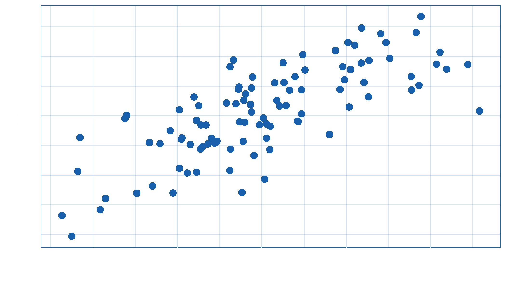

## Heading

```{=html}
<!-- these fences CANNOT be nested -->
```
::: incremental
-   something
-   another thing

not a bullet point but still incremental
:::

## Image captions

-   `.frame` class adds a white border to image and caption
-   `.rot` class slightly rotates image and caption
-   `source=` attribute adds link to source in caption

## chrom

{.frame .rot height="500"
source="http://book.bionumbers.org/how-many-chromosomes-are-found-in-different-organisms/"}

## bible

::: {.times .incremental}
::: rtl
בְּרֵאשִׁית בָּרָא אֱלֹהִים אֵת הַשָּׁמַיִם וְאֵת הָאָֽרֶץ׃
:::

ἐν ἀρχῇ ἐποίησεν ὁ θεὸς τὸν οὐρανὸν καὶ τὴν γῆν
:::

## dancer


```{=html}
<!-- The below produces an animated timeline of CV -->
```
## Who am I? {#who-am-i .hidden auto-animate="true"}

::: {.animate-title data-id="animate-title"}
Who am I?
:::

::: {.timeline style="font-size:25px"}
```{=html}
<ul style="grid-template-rows:repeat(2, 4em);">
```
```{=html}
<li class data-id="p1" data-auto-animate-delay="0.7">
```
::: timeline-item
::: {.what .item-heading}
PhD Psychology
:::

::: {.where .item-title}
University of Edinburgh
:::

::: when
2011-2015
:::
:::

```{=html}
</li>
```
::: {.line data-id="line" style="grid-row:1/2;"}
:::

::: {.dot data-id="dot" style="grid-row:1;"}
:::

```{=html}
</ul>
```
:::

##  {#section .hidden auto-animate="true"}

::: {.animate-title data-id="animate-title"}
Who am I?
:::

::: {.timeline style="font-size:25px"}
```{=html}
<ul style="grid-template-rows:repeat(3, 4em);">
```
```{=html}
<li class data-id="p1" data-auto-animate-delay="0.7">
```
::: timeline-item
::: {.what .item-heading}
PhD Psychology
:::

::: {.where .item-title}
University of Edinburgh
:::

::: when
2011-2015
:::
:::

```{=html}
</li>
```
```{=html}
<li class data-id="p2" data-auto-animate-delay="0.7">
```
::: timeline-item
::: {.what .item-heading}
Psychometrics
:::

::: {.where .item-title}
Royal College of Surgeons of Edinburgh
:::

::: when
2015-2017
:::
:::

```{=html}
</li>
```
::: {.line data-id="line" style="grid-row:1/3;"}
:::

::: {.dot data-id="dot" style="grid-row:2;"}
:::

```{=html}
</ul>
```
:::

##  {#section-1 .hidden auto-animate="true"}

::: {.animate-title data-id="animate-title"}
Who am I?
:::

::: {.timeline style="font-size:25px"}
```{=html}
<ul style="grid-template-rows:repeat(4, 4em);">
```
```{=html}
<li class data-id="p1" data-auto-animate-delay="0.7">
```
::: timeline-item
::: {.what .item-heading}
PhD Psychology
:::

::: {.where .item-title}
University of Edinburgh
:::

::: when
2011-2015
:::
:::

```{=html}
</li>
```
```{=html}
<li class data-id="p2" data-auto-animate-delay="0.7">
```
::: timeline-item
::: {.what .item-heading}
Psychometrics
:::

::: {.where .item-title}
Royal College of Surgeons of Edinburgh
:::

::: when
2015-2017
:::
:::

```{=html}
</li>
```
```{=html}
<li class data-id="p3" data-auto-animate-delay="0.7">
```
::: timeline-item
::: {.what .item-heading}
Teacher/Lecturer in research methods & statistics
:::

::: {.where .item-title}
Universities of Edinburgh and Sussex
:::

::: when
2017-2022
:::
:::

```{=html}
</li>
```
::: {.line data-id="line" style="grid-row:1/4;"}
:::

::: {.dot data-id="dot" style="grid-row:3;"}
:::

```{=html}
</ul>
```
:::

##  {#section-2 .hidden auto-animate="true"}

::: {.animate-title data-id="animate-title"}
Who am I?
:::

::: {.timeline style="font-size:25px"}
```{=html}
<ul style="grid-template-rows:repeat(5, 4em);">
```
```{=html}
<li class data-id="p1" data-auto-animate-delay="0.7">
```
::: timeline-item
::: {.what .item-heading}
PhD Psychology
:::

::: {.where .item-title}
University of Edinburgh
:::

::: when
2011-2015
:::
:::

```{=html}
</li>
```
```{=html}
<li class data-id="p2" data-auto-animate-delay="0.7">
```
::: timeline-item
::: {.what .item-heading}
Psychometrics
:::

::: {.where .item-title}
Royal College of Surgeons of Edinburgh
:::

::: when
2015-2017
:::
:::

```{=html}
</li>
```
```{=html}
<li class data-id="p3" data-auto-animate-delay="0.7">
```
::: timeline-item
::: {.what .item-heading}
Teacher/Lecturer in research methods & statistics
:::

::: {.where .item-title}
Universities of Edinburgh and Sussex
:::

::: when
2017-2022
:::
:::

```{=html}
</li>
```
```{=html}
<li class=" last" data-id="p4" data-auto-animate-delay="0.7">
```
::: timeline-item
::: {.what .item-heading}
Research associate
:::

::: {.where .item-title}
InfAR @ Bauhaus
:::

::: when
2022-present
:::
:::

```{=html}
</li>
```
::: {.line data-id="line" style="grid-row:1/5;"}
:::

::: {.dot data-id="dot" style="grid-row:4;"}
:::

```{=html}
</ul>
```
:::

## scatter

-   `R` plots are displayed in tabsets with code available
-   custom `ggplot2` theme set by default

::: cell
``` {.r .cell-code}
df <- tibble::tibble(x = rnorm(100), y = x + rnorm(100))
df |>
    ggplot(aes(x, y)) +
    geom_point() +
    labs(x = "blah", y = "blee")
```

::: cell-output-display

:::
:::
