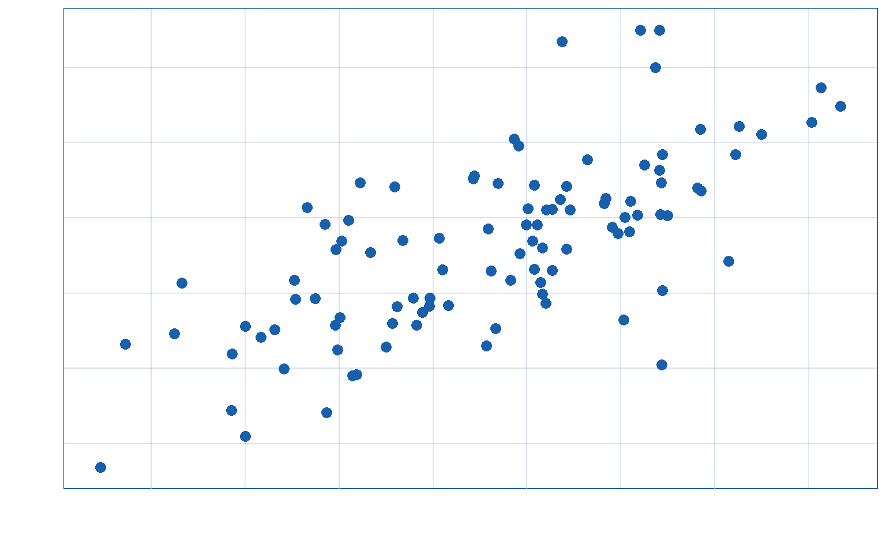
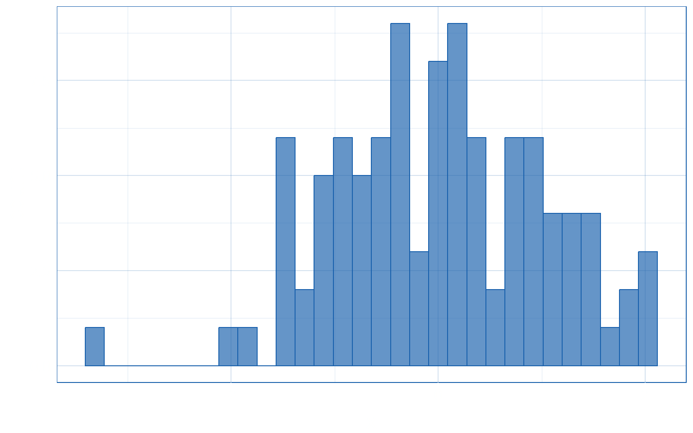

## Welcome

-   something

**bold**

[some link](https://www.google.com)

 <h2 class="hidden" auto-animate="true" auto-animate-easing="ease-in-out">Who am I?</h2>

Who am I?

<ul><li data-id="p1">
2011-2015

PhD Psychology

University of Edinburgh
</li></ul></alt-div>
<h2 class="hidden" auto-animate="true" auto-animate-easing="ease-in-out"></h2>

Who am I?

<ul><li data-id="p1">
2011-2015

PhD Psychology

University of Edinburgh
</li><li data-id="p2">
2015-2017

Psychometrics

Royal College of Surgeons of Edinburgh
</li></ul></alt-div>
<h2 class="hidden" auto-animate="true" auto-animate-easing="ease-in-out"></h2>

Who am I?

<ul><li data-id="p1">
2011-2015

PhD Psychology

University of Edinburgh
</li><li data-id="p2">
2015-2017

Psychometrics

Royal College of Surgeons of Edinburgh
</li><li data-id="p3">
2017-2022

Teacher/Lecturer in research methods & statistics

Universities of Edinburgh and Sussex
</li></ul></alt-div>
<h2 class="hidden" auto-animate="true" auto-animate-easing="ease-in-out"></h2>

Who am I?

<ul><li data-id="p1">
2011-2015

PhD Psychology

University of Edinburgh
</li><li data-id="p2">
2015-2017

Psychometrics

Royal College of Surgeons of Edinburgh
</li><li data-id="p3">
2017-2022

Teacher/Lecturer in research methods & statistics

Universities of Edinburgh and Sussex
</li><li data-id="p4">
2022-present

Research associate

InfAR @ Bauhaus
</li></ul></alt-div>
 

## scatter

## Hist

