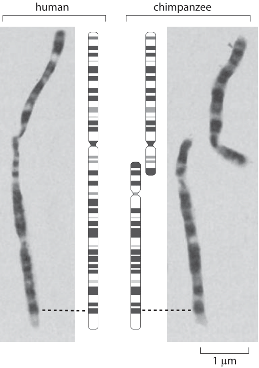

<script src="index_files/libs/kePrint-0.0.1/kePrint.js"></script>
<link href="index_files/libs/lightable-0.0.1/lightable.css" rel="stylesheet" />


## Today

::: incremental
-   Getting to know each other
-   Why research skills?
-   Learning outcomes
-   Course curriculum
-   Assessment
-   Course timeline
:::

```{=html}
<!-- ## chrom

{.frame .rot height=500 source="http://book.bionumbers.org/how-many-chromosomes-are-found-in-different-organisms/"} -->
```
## Ground rules

-   Be kind and respectful
-   Let's make everyone feel safe with respect to who they are
    -   No racism :raised_fist::skin-tone-6: :raised_fist::skin-tone-4:
        :raised_fist::skin-tone-2:
    -   No sexism :female_sign: :transgender_symbol: :male_sign:
    -   LGBTQ+ inclusive environment :rainbow:
-   It's OK to disagree but let's keep things friendly

## Who am I?

::: contact
::: none
{.hero .frame height="150"}

#notanarchitect
:::

::: {.frame .rot}
Milan (he/him)

<milan.valasek@uni-weimar.de>

 

InfAR

Room 203

Belvederer Allee 1
:::
:::

##  {#section .hidden auto-animate="true"}

::: {.animate-title data-id="animate-title"}
Who am I?
:::

::: {.timeline style="font-size:25px"}
```{=html}
<ul style="grid-template-rows:repeat(2, 4em);">
```
```{=html}
<li class data-id="p1" data-auto-animate-delay="0.7">
```
::: timeline-item
::: {.when .item-heading}
2005-2010
:::

::: {.what .item-title}
Mgr (MSc) Psychology
:::

::: where
Komenius University, Bratislava
:::
:::

```{=html}
</li>
```
::: {.line data-id="line" style="grid-row:1/2;"}
:::

::: {.dot data-id="dot" style="grid-row:1;"}
:::

```{=html}
</ul>
```
:::

##  {#section-1 .hidden auto-animate="true"}

::: {.animate-title data-id="animate-title"}
Who am I?
:::

::: {.timeline style="font-size:25px"}
```{=html}
<ul style="grid-template-rows:repeat(3, 4em);">
```
```{=html}
<li class data-id="p1" data-auto-animate-delay="0.7">
```
::: timeline-item
::: {.when .item-heading}
2005-2010
:::

::: {.what .item-title}
Mgr (MSc) Psychology
:::

::: where
Komenius University, Bratislava
:::
:::

```{=html}
</li>
```
```{=html}
<li class data-id="p2" data-auto-animate-delay="0.7">
```
::: timeline-item
::: {.when .item-heading}
2011-2015
:::

::: {.what .item-title}
PhD Psychology
:::

::: where
University of Edinburgh
:::
:::

```{=html}
</li>
```
::: {.line data-id="line" style="grid-row:1/3;"}
:::

::: {.dot data-id="dot" style="grid-row:2;"}
:::

```{=html}
</ul>
```
:::

##  {#section-2 .hidden auto-animate="true"}

::: {.animate-title data-id="animate-title"}
Who am I?
:::

::: {.timeline style="font-size:25px"}
```{=html}
<ul style="grid-template-rows:repeat(4, 4em);">
```
```{=html}
<li class data-id="p1" data-auto-animate-delay="0.7">
```
::: timeline-item
::: {.when .item-heading}
2005-2010
:::

::: {.what .item-title}
Mgr (MSc) Psychology
:::

::: where
Komenius University, Bratislava
:::
:::

```{=html}
</li>
```
```{=html}
<li class data-id="p2" data-auto-animate-delay="0.7">
```
::: timeline-item
::: {.when .item-heading}
2011-2015
:::

::: {.what .item-title}
PhD Psychology
:::

::: where
University of Edinburgh
:::
:::

```{=html}
</li>
```
```{=html}
<li class data-id="p3" data-auto-animate-delay="0.7">
```
::: timeline-item
::: {.when .item-heading}
2015-2017
:::

::: {.what .item-title}
Psychometrics
:::

::: where
Royal College of Surgeons of Edinburgh
:::
:::

```{=html}
</li>
```
::: {.line data-id="line" style="grid-row:1/4;"}
:::

::: {.dot data-id="dot" style="grid-row:3;"}
:::

```{=html}
</ul>
```
:::

##  {#section-3 .hidden auto-animate="true"}

::: {.animate-title data-id="animate-title"}
Who am I?
:::

::: {.timeline style="font-size:25px"}
```{=html}
<ul style="grid-template-rows:repeat(5, 4em);">
```
```{=html}
<li class data-id="p1" data-auto-animate-delay="0.7">
```
::: timeline-item
::: {.when .item-heading}
2005-2010
:::

::: {.what .item-title}
Mgr (MSc) Psychology
:::

::: where
Komenius University, Bratislava
:::
:::

```{=html}
</li>
```
```{=html}
<li class data-id="p2" data-auto-animate-delay="0.7">
```
::: timeline-item
::: {.when .item-heading}
2011-2015
:::

::: {.what .item-title}
PhD Psychology
:::

::: where
University of Edinburgh
:::
:::

```{=html}
</li>
```
```{=html}
<li class data-id="p3" data-auto-animate-delay="0.7">
```
::: timeline-item
::: {.when .item-heading}
2015-2017
:::

::: {.what .item-title}
Psychometrics
:::

::: where
Royal College of Surgeons of Edinburgh
:::
:::

```{=html}
</li>
```
```{=html}
<li class data-id="p4" data-auto-animate-delay="0.7">
```
::: timeline-item
::: {.when .item-heading}
2017-2019
:::

::: {.what .item-title}
Postdoctoral Tutor in statistics
:::

::: where
University of Edinburgh
:::
:::

```{=html}
</li>
```
::: {.line data-id="line" style="grid-row:1/5;"}
:::

::: {.dot data-id="dot" style="grid-row:4;"}
:::

```{=html}
</ul>
```
:::

##  {#section-4 .hidden auto-animate="true"}

::: {.animate-title data-id="animate-title"}
Who am I?
:::

::: {.timeline style="font-size:25px"}
```{=html}
<ul style="grid-template-rows:repeat(6, 4em);">
```
```{=html}
<li class data-id="p1" data-auto-animate-delay="0.7">
```
::: timeline-item
::: {.when .item-heading}
2005-2010
:::

::: {.what .item-title}
Mgr (MSc) Psychology
:::

::: where
Komenius University, Bratislava
:::
:::

```{=html}
</li>
```
```{=html}
<li class data-id="p2" data-auto-animate-delay="0.7">
```
::: timeline-item
::: {.when .item-heading}
2011-2015
:::

::: {.what .item-title}
PhD Psychology
:::

::: where
University of Edinburgh
:::
:::

```{=html}
</li>
```
```{=html}
<li class data-id="p3" data-auto-animate-delay="0.7">
```
::: timeline-item
::: {.when .item-heading}
2015-2017
:::

::: {.what .item-title}
Psychometrics
:::

::: where
Royal College of Surgeons of Edinburgh
:::
:::

```{=html}
</li>
```
```{=html}
<li class data-id="p4" data-auto-animate-delay="0.7">
```
::: timeline-item
::: {.when .item-heading}
2017-2019
:::

::: {.what .item-title}
Postdoctoral Tutor in statistics
:::

::: where
University of Edinburgh
:::
:::

```{=html}
</li>
```
```{=html}
<li class data-id="p5" data-auto-animate-delay="0.7">
```
::: timeline-item
::: {.when .item-heading}
2019-2022
:::

::: {.what .item-title}
Lecturer in research methods & statistics
:::

::: where
University of Sussex
:::
:::

```{=html}
</li>
```
::: {.line data-id="line" style="grid-row:1/6;"}
:::

::: {.dot data-id="dot" style="grid-row:5;"}
:::

```{=html}
</ul>
```
:::

##  {#section-5 .hidden auto-animate="true"}

::: {.animate-title data-id="animate-title"}
Who am I?
:::

::: {.timeline style="font-size:25px"}
```{=html}
<ul style="grid-template-rows:repeat(7, 4em);">
```
```{=html}
<li class data-id="p1" data-auto-animate-delay="0.7">
```
::: timeline-item
::: {.when .item-heading}
2005-2010
:::

::: {.what .item-title}
Mgr (MSc) Psychology
:::

::: where
Komenius University, Bratislava
:::
:::

```{=html}
</li>
```
```{=html}
<li class data-id="p2" data-auto-animate-delay="0.7">
```
::: timeline-item
::: {.when .item-heading}
2011-2015
:::

::: {.what .item-title}
PhD Psychology
:::

::: where
University of Edinburgh
:::
:::

```{=html}
</li>
```
```{=html}
<li class data-id="p3" data-auto-animate-delay="0.7">
```
::: timeline-item
::: {.when .item-heading}
2015-2017
:::

::: {.what .item-title}
Psychometrics
:::

::: where
Royal College of Surgeons of Edinburgh
:::
:::

```{=html}
</li>
```
```{=html}
<li class data-id="p4" data-auto-animate-delay="0.7">
```
::: timeline-item
::: {.when .item-heading}
2017-2019
:::

::: {.what .item-title}
Postdoctoral Tutor in statistics
:::

::: where
University of Edinburgh
:::
:::

```{=html}
</li>
```
```{=html}
<li class data-id="p5" data-auto-animate-delay="0.7">
```
::: timeline-item
::: {.when .item-heading}
2019-2022
:::

::: {.what .item-title}
Lecturer in research methods & statistics
:::

::: where
University of Sussex
:::
:::

```{=html}
</li>
```
```{=html}
<li class="last" data-id="p6" data-auto-animate-delay="0.7">
```
::: timeline-item
::: {.when .item-heading}
2022-present
:::

::: {.what .item-title}
Research associate
:::

::: where
InfAR @ Bauhaus
:::
:::

```{=html}
</li>
```
::: {.line data-id="line" style="grid-row:1/7;"}
:::

::: {.dot data-id="dot" style="grid-row:6;"}
:::

```{=html}
</ul>
```
:::

## Who are you?

-   What's your name?
-   Where is home?
-   What's your academic background?
-   Do you have experience conducting research (qualitative or
    quantitative)?
-   What interests you about urban development and design
-   A fun fact about you
    -   hobby
    -   special ability
    -   favourite show/movie...

## Why research skills?

::: incremental
-   This is a Master of **Science** programme
-   You will be required to produce a research^1^ thesis
-   Your practice as architects, urban planners, designers, and policy
    influencers should be **evidence-based**
-   Understanding how research is done is just good for the soul
    :upside_down:

1\. or design...{.fn}
:::

## Learning outcomes

By the end of this course you will:

::: incremental
-   be familiar with basic concepts in philosophy of science
-   understand the difference in **qualitative** and **quantitative**
    approaches to research and their respective merits
-   appreciate the value of **theory** and its relationship with
    **research questions** and **hypotheses**
-   understand the role of **measurement** in science
-   know the principle of **hypothesis testing**
-   learn how the world can be described with **statistics**
-   able to **critically evaluate** published literature
-   able to **conduct and write about your own research**
:::

## Curriculum

::: cell
::: cell-output-display
   Week  Topic
  ------ ---------------------------------------
    1    Intro to philosophy of science
    2    Research question, hypothesis, theory
    3    Public holiday :tada::tada::tada:
    4    Qualitative and Quantitative methods
    5    Study design
    6    Data and levels of measurement
    7    Designing measures
    8    Collecting data
    9    Descriptive statistics
    10   Basic data visualisation
    11   Probability distributions
    12   Statistical testing & correlation
    13   Writing an academic paper/report

```{=html}

```
:::
:::

## Assessment

### 60% in class engagement & homework

-   Take part in discussion
-   Submit homework on time
-   Engage in peer review
-   Follow the [assignment roadmap](./#/assignment-roadmap)

### 40% end of term assignment

-   Well-written and -formatted report on your mini-project

```{=html}
<!-- Assignment roadmap -->
```
## Assignment roadmap {#assignment-roadmap .hidden auto-animate="true"}

::: {.animate-title data-id="animate-title"}
Assignment roadmap
:::

::: {.timeline style="font-size:21px"}
```{=html}
<ul style="grid-template-rows:repeat(2, 4em);">
```
```{=html}
<li class data-id="p1" data-auto-animate-delay="0.7">
```
::: timeline-item
::: {.when .item-heading}
Week 2
:::

::: {.what .item-title}
Research topic
:::
:::

```{=html}
</li>
```
::: {.line data-id="line" style="grid-row:1/2;"}
:::

::: {.dot data-id="dot" style="grid-row:1;"}
:::

```{=html}
</ul>
```
:::

##  {#section-6 .hidden auto-animate="true"}

::: {.animate-title data-id="animate-title"}
Assignment roadmap
:::

::: {.timeline style="font-size:21px"}
```{=html}
<ul style="grid-template-rows:repeat(3, 4em);">
```
```{=html}
<li class data-id="p1" data-auto-animate-delay="0.7">
```
::: timeline-item
::: {.when .item-heading}
Week 2
:::

::: {.what .item-title}
Research topic
:::
:::

```{=html}
</li>
```
```{=html}
<li class data-id="p2" data-auto-animate-delay="0.7">
```
::: timeline-item
::: {.when .item-heading}
Week 4
:::

::: {.what .item-title}
Research question
:::
:::

```{=html}
</li>
```
::: {.line data-id="line" style="grid-row:1/3;"}
:::

::: {.dot data-id="dot" style="grid-row:2;"}
:::

```{=html}
</ul>
```
:::

##  {#section-7 .hidden auto-animate="true"}

::: {.animate-title data-id="animate-title"}
Assignment roadmap
:::

::: {.timeline style="font-size:21px"}
```{=html}
<ul style="grid-template-rows:repeat(4, 4em);">
```
```{=html}
<li class data-id="p1" data-auto-animate-delay="0.7">
```
::: timeline-item
::: {.when .item-heading}
Week 2
:::

::: {.what .item-title}
Research topic
:::
:::

```{=html}
</li>
```
```{=html}
<li class data-id="p2" data-auto-animate-delay="0.7">
```
::: timeline-item
::: {.when .item-heading}
Week 4
:::

::: {.what .item-title}
Research question
:::
:::

```{=html}
</li>
```
```{=html}
<li class data-id="p3" data-auto-animate-delay="0.7">
```
::: timeline-item
::: {.when .item-heading}
Week 5
:::

::: {.what .item-title}
Hypothesis/-es
:::
:::

```{=html}
</li>
```
::: {.line data-id="line" style="grid-row:1/4;"}
:::

::: {.dot data-id="dot" style="grid-row:3;"}
:::

```{=html}
</ul>
```
:::

##  {#section-8 .hidden auto-animate="true"}

::: {.animate-title data-id="animate-title"}
Assignment roadmap
:::

::: {.timeline style="font-size:21px"}
```{=html}
<ul style="grid-template-rows:repeat(5, 4em);">
```
```{=html}
<li class data-id="p1" data-auto-animate-delay="0.7">
```
::: timeline-item
::: {.when .item-heading}
Week 2
:::

::: {.what .item-title}
Research topic
:::
:::

```{=html}
</li>
```
```{=html}
<li class data-id="p2" data-auto-animate-delay="0.7">
```
::: timeline-item
::: {.when .item-heading}
Week 4
:::

::: {.what .item-title}
Research question
:::
:::

```{=html}
</li>
```
```{=html}
<li class data-id="p3" data-auto-animate-delay="0.7">
```
::: timeline-item
::: {.when .item-heading}
Week 5
:::

::: {.what .item-title}
Hypothesis/-es
:::
:::

```{=html}
</li>
```
```{=html}
<li class data-id="p4" data-auto-animate-delay="0.7">
```
::: timeline-item
::: {.when .item-heading}
Week 7
:::

::: {.what .item-title}
Methodology
:::
:::

```{=html}
</li>
```
::: {.line data-id="line" style="grid-row:1/5;"}
:::

::: {.dot data-id="dot" style="grid-row:4;"}
:::

```{=html}
</ul>
```
:::

##  {#section-9 .hidden auto-animate="true"}

::: {.animate-title data-id="animate-title"}
Assignment roadmap
:::

::: {.timeline style="font-size:21px"}
```{=html}
<ul style="grid-template-rows:repeat(6, 4em);">
```
```{=html}
<li class data-id="p1" data-auto-animate-delay="0.7">
```
::: timeline-item
::: {.when .item-heading}
Week 2
:::

::: {.what .item-title}
Research topic
:::
:::

```{=html}
</li>
```
```{=html}
<li class data-id="p2" data-auto-animate-delay="0.7">
```
::: timeline-item
::: {.when .item-heading}
Week 4
:::

::: {.what .item-title}
Research question
:::
:::

```{=html}
</li>
```
```{=html}
<li class data-id="p3" data-auto-animate-delay="0.7">
```
::: timeline-item
::: {.when .item-heading}
Week 5
:::

::: {.what .item-title}
Hypothesis/-es
:::
:::

```{=html}
</li>
```
```{=html}
<li class data-id="p4" data-auto-animate-delay="0.7">
```
::: timeline-item
::: {.when .item-heading}
Week 7
:::

::: {.what .item-title}
Methodology
:::
:::

```{=html}
</li>
```
```{=html}
<li class data-id="p5" data-auto-animate-delay="0.7">
```
::: timeline-item
::: {.when .item-heading}
Week 10
:::

::: {.what .item-title}
Data collection
:::
:::

```{=html}
</li>
```
::: {.line data-id="line" style="grid-row:1/6;"}
:::

::: {.dot data-id="dot" style="grid-row:5;"}
:::

```{=html}
</ul>
```
:::

##  {#section-10 .hidden auto-animate="true"}

::: {.animate-title data-id="animate-title"}
Assignment roadmap
:::

::: {.timeline style="font-size:21px"}
```{=html}
<ul style="grid-template-rows:repeat(7, 4em);">
```
```{=html}
<li class data-id="p1" data-auto-animate-delay="0.7">
```
::: timeline-item
::: {.when .item-heading}
Week 2
:::

::: {.what .item-title}
Research topic
:::
:::

```{=html}
</li>
```
```{=html}
<li class data-id="p2" data-auto-animate-delay="0.7">
```
::: timeline-item
::: {.when .item-heading}
Week 4
:::

::: {.what .item-title}
Research question
:::
:::

```{=html}
</li>
```
```{=html}
<li class data-id="p3" data-auto-animate-delay="0.7">
```
::: timeline-item
::: {.when .item-heading}
Week 5
:::

::: {.what .item-title}
Hypothesis/-es
:::
:::

```{=html}
</li>
```
```{=html}
<li class data-id="p4" data-auto-animate-delay="0.7">
```
::: timeline-item
::: {.when .item-heading}
Week 7
:::

::: {.what .item-title}
Methodology
:::
:::

```{=html}
</li>
```
```{=html}
<li class data-id="p5" data-auto-animate-delay="0.7">
```
::: timeline-item
::: {.when .item-heading}
Week 10
:::

::: {.what .item-title}
Data collection
:::
:::

```{=html}
</li>
```
```{=html}
<li class data-id="p6" data-auto-animate-delay="0.7">
```
::: timeline-item
::: {.when .item-heading}
Week 12
:::

::: {.what .item-title}
Data analysis
:::
:::

```{=html}
</li>
```
::: {.line data-id="line" style="grid-row:1/7;"}
:::

::: {.dot data-id="dot" style="grid-row:6;"}
:::

```{=html}
</ul>
```
:::

##  {#section-11 .hidden auto-animate="true"}

::: {.animate-title data-id="animate-title"}
Assignment roadmap
:::

::: {.timeline style="font-size:21px"}
```{=html}
<ul style="grid-template-rows:repeat(8, 4em);">
```
```{=html}
<li class data-id="p1" data-auto-animate-delay="0.7">
```
::: timeline-item
::: {.when .item-heading}
Week 2
:::

::: {.what .item-title}
Research topic
:::
:::

```{=html}
</li>
```
```{=html}
<li class data-id="p2" data-auto-animate-delay="0.7">
```
::: timeline-item
::: {.when .item-heading}
Week 4
:::

::: {.what .item-title}
Research question
:::
:::

```{=html}
</li>
```
```{=html}
<li class data-id="p3" data-auto-animate-delay="0.7">
```
::: timeline-item
::: {.when .item-heading}
Week 5
:::

::: {.what .item-title}
Hypothesis/-es
:::
:::

```{=html}
</li>
```
```{=html}
<li class data-id="p4" data-auto-animate-delay="0.7">
```
::: timeline-item
::: {.when .item-heading}
Week 7
:::

::: {.what .item-title}
Methodology
:::
:::

```{=html}
</li>
```
```{=html}
<li class data-id="p5" data-auto-animate-delay="0.7">
```
::: timeline-item
::: {.when .item-heading}
Week 10
:::

::: {.what .item-title}
Data collection
:::
:::

```{=html}
</li>
```
```{=html}
<li class data-id="p6" data-auto-animate-delay="0.7">
```
::: timeline-item
::: {.when .item-heading}
Week 12
:::

::: {.what .item-title}
Data analysis
:::
:::

```{=html}
</li>
```
```{=html}
<li class="last" data-id="p7" data-auto-animate-delay="0.7">
```
::: timeline-item
::: {.when .item-heading}
January 2024
:::

::: {.what .item-title}
Project submission
:::
:::

```{=html}
</li>
```
::: {.line data-id="line" style="grid-row:1/8;"}
:::

::: {.dot data-id="dot" style="grid-row:7;"}
:::

```{=html}
</ul>
```
:::

## Course resources

-   All course content can be found on
    [Moodle](https://moodle.uni-weimar.de/)
    -   Weekly topics and slides
    -   Additional resources
    -   Course info
    -   Discussion boards
    -   Organisational announcements
-   For collaborative activities, we'll *try* using a [Miro
    board](https://miro.com/welcomeonboard/MVMwS2YxanI3QmpHd3hzNG9CWXpDT3NxaW1ERFZ2dDVZVUo4T2NEZDd1OTN1N2xFdU53Tm1vTlh6UFpLdXBVQnwzNDU4NzY0NTY1MzcyODYzNTkwfDI=?share_link_id=933100515695)
    -   Sign up with your uni email!

## Miro board

```{=html}
<iframe width="100%" height="550px" src="https://miro.com/app/live-embed/uXjVNfgkf3I=/?moveToViewport=-893,-1963,11018,5741&amp;embedId=740713753465" frameborder="0" scrolling="no" allow="fullscreen; clipboard-read; clipboard-write" allowfullscreen>
```
```{=html}
</iframe>
```
## The deal

::: {.columns .tight}
::: column
### **You**

::: incremental
-   Come to class
-   Engage actively
-   Ask questions (there are no stupid Qs!)
-   Do your homework
-   Put in the effort
-   Ask for help if you are struggling
-   Give me feedback
-   Have patience with yourself, one another, me
:::
:::

::: column
### **Me**

::: incremental
-   Do my best to make this interesting & relevant
-   Try to meet you where you are
-   Will be flexible and responsive about the curriculum
-   Carefully read all your homework and assignment submission
-   Give thorough & helpful feedback
:::
:::
:::
