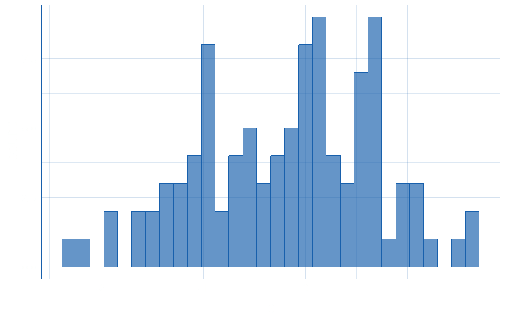

## Welcome

-   something

**bold**

[some link](https://www.google.com)

 <h2 class="hidden" auto-animate="true" auto-animate-easing="ease-in-out">Who am I?</h2>
<div class="animate-title" data-id="animate-title">Who am I?</div>
<div class="timeline">
<div class="line" data-id="line"></div><ul><li data-id="p1"><div class="when">2011-2015</div>
<div class="what">PhD Psychology</div>
<div class="where">University of Edinburgh</div></li></ul></alt-div>
<h2 class="hidden" auto-animate="true" auto-animate-easing="ease-in-out"></h2>
<div class="animate-title" data-id="animate-title">Who am I?</div>
<div class="timeline">
<div class="line" data-id="line"></div><ul><li data-id="p1"><div class="when">2011-2015</div>
<div class="what">PhD Psychology</div>
<div class="where">University of Edinburgh</div></li><li data-id="p2"><div class="when">2015-2017</div>
<div class="what">Psychometrics</div>
<div class="where">Royal College of Surgeons of Edinburgh</div></li></ul></alt-div>
<h2 class="hidden" auto-animate="true" auto-animate-easing="ease-in-out"></h2>
<div class="animate-title" data-id="animate-title">Who am I?</div>
<div class="timeline">
<div class="line" data-id="line"></div><ul><li data-id="p1"><div class="when">2011-2015</div>
<div class="what">PhD Psychology</div>
<div class="where">University of Edinburgh</div></li><li data-id="p2"><div class="when">2015-2017</div>
<div class="what">Psychometrics</div>
<div class="where">Royal College of Surgeons of Edinburgh</div></li><li data-id="p3"><div class="when">2017-2022</div>
<div class="what">Teacher/Lecturer in research methods & statistics</div>
<div class="where">Universities of Edinburgh and Sussex</div></li></ul></alt-div>
<h2 class="hidden" auto-animate="true" auto-animate-easing="ease-in-out"></h2>
<div class="animate-title" data-id="animate-title">Who am I?</div>
<div class="timeline">
<div class="line" data-id="line"></div><ul><li data-id="p1"><div class="when">2011-2015</div>
<div class="what">PhD Psychology</div>
<div class="where">University of Edinburgh</div></li><li data-id="p2"><div class="when">2015-2017</div>
<div class="what">Psychometrics</div>
<div class="where">Royal College of Surgeons of Edinburgh</div></li><li data-id="p3"><div class="when">2017-2022</div>
<div class="what">Teacher/Lecturer in research methods & statistics</div>
<div class="where">Universities of Edinburgh and Sussex</div></li><li data-id="p4"><div class="when">2022-present</div>
<div class="what">Research associate</div>
<div class="where">InfAR @ Bauhaus</div></li></ul></alt-div>
 

## scatter

``` r
library(ggplot2)
main_col = "#1860ac"
update_geom_defaults("point", list(colour = main_col, size = 3))
update_geom_defaults("bar", list(colour = main_col, fill = paste0(main_col, "aa")))
my_theme <- theme(
        line = element_line(colour = main_col),
        text = element_text(colour = main_col),
        plot.background = element_blank(),
        panel.background = element_rect(
            fill = "white",
            colour = main_col),
        panel.grid.major = element_line(colour = paste0(main_col, "30")),
        panel.grid.minor = element_line(colour = paste0(main_col, "25")),
        axis.ticks = element_line(colour = "white"),
        axis.text = element_text(colour = "white", size = 12),
        axis.title = element_text(colour = "white", size = 18),
        axis.title.x.bottom = element_text(vjust=-0.5)
    )
df <- tibble::tibble(x = rnorm(100), y = x + rnorm(100))
df |>
    ggplot(aes(x, y)) +
    geom_point() +
    labs(x = "blah", y = "blee") +
    my_theme
```


## Hist

``` r
df |>
    ggplot(aes(x)) + geom_histogram() + my_theme
```


