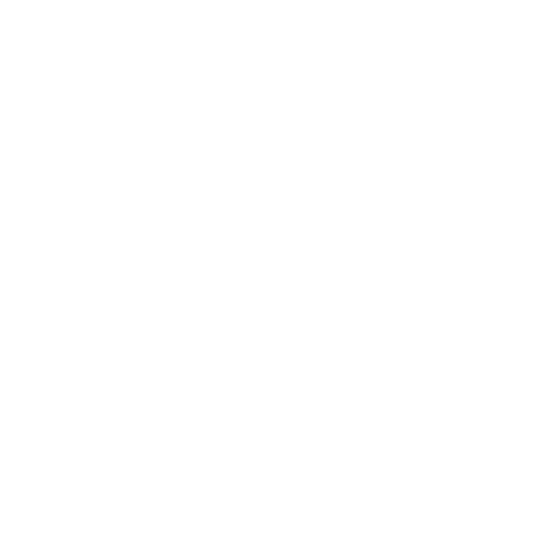

## Today

::: incremental
-   Structure of academic paper/thesis
-   Introduction section
    -   Purpose
    -   Structure
    -   Content
    -   Tips
-   Forming testable hypotheses
    -   Conceptualisation
    -   Operationalisation
    -   Formalisation
:::

## IMRaD {#imrad auto-animate="true"}

::: incremental
**I**ntroduction

**M**ethods

**R**esults [**a**nd]{data-id="foo" style="opacity:100%;"}

**D**iscussion
:::

## IMRaD {#imrad-1 auto-animate="true"}

{style="position:absolute;left:0;right:0;"}

::: {style="margin-top:180px;margin-left:100px;color:#f59f00;font-weight:400;"}
Introduction
:::

::: {style="margin-top:110px;margin-left:100px;color:#f59f00;font-weight:400;"}
Methods
:::

::: {style="margin-top:20px;margin-left:100px;color:#f59f00;font-weight:400;"}
Results [**a**nd]{data-id="foo" style="opacity:0%;"}
:::

::: {style="margin-top:100px;margin-left:100px;color:#f59f00;font-weight:400;"}
Discussion
:::

## Introduction

::: incremental
-   Introduces the reader to the problem at hand
-   Explains why the research is relevant
-   Points at a knowledge gap
-   Reviews and **analyses** literature
-   States the research question (and conceptual hypothesis)
-   Links the study with the analysis of the topic with clear line of
    argumentation
:::

## Establish a niche

::: incremental
-   Start with an observation that gets the reader interested
-   Define the problem and necessary terms
-   Explain why the topic is worthy of exploration
-   Provide brief summary of the general state of knowledge
-   Point at a problem
-   Identify a gap/disagreement/insufficiency in literature
:::

## Literature review

::: incremental
-   Introduces important concepts and findings to the reader
-   Structures your argument and anchors it to existing research
-   Demonstrates that you've "done your homework"
-   Review most relevant/important literature for each concept you're
    dealing with
-   Don't just summarise; analyse/critically examine
:::

## Link to present study

::: incremental
-   Line of argument presented in Intro connects the problem with your
    study
-   By the end of Intro, the reader should understand
    -   What is the problem at hand
    -   What is the aim of the study
    -   Why study the problem in this way
    -   What is the specific research question (explicitly stated)
    -   What (if any) hypotheses are you testing
:::

## Hypothesis

-   Statement about something in the world that
-   Either true or false
-   Not yet been shown to be true or false
-   Often stated in terms of differences or relationships between
    things/people/groups

## What makes a good hypothesis?

::: incremental
-   **Testability** - it must be possible for the data to either support
    or disconfirm a hypothesis

-   **Specificity** - it must be clear what exactly is being claimed and
    what the expectation is

-   Brief and clearly formulated, and about a single thing

-   **Good hypothesis:** *"The recent observed rising trend in global
    temperatures on Earth is primarily driven by human-produced
    greenhouse gas emissions."*

-   **Bad hypothesis:** *"Homœopathic products can cure people, but
    sometimes they make them worse before they make them better, and the
    effect is only apparent subjectively with respect to some vague
    'holistic' notions rather than a specific well-defined and testable
    set of criteria."*
:::

## Levels of hypothesis

::: incremental
-   **Conceptual**: Expressed in normal language on the level of
    concepts/constructs
-   **Operational**: Restates a conceptual hypothesis in terms of how
    constructs are measured in a given study
-   **Statistical**: Translates an operational hypothesis into language
    of mathematics
:::

## Conceptualisation

::: incremental
-   Let's say we're interested in factors predicting [sport
    climbing](https://en.wikipedia.org/wiki/Sport_climbing) performance
-   **Research question:** Are there morphological characteristics that
    predispose some people to be better at climbing?
-   We have a hunch that having relatively long arms might be beneficial

 

-   **Conceptual hypothesis:** Climbers have relatively longer arms than
    non-climbers
:::

## Operationalisation

::: incremental
-   Process of defining variables in terms of how they are measured
    -   The *concept* of street business can be operationalised as the
        average number of pedestrians who enter the street in an
        one-hour window measured on 5 different occasions
    -   The *concept* of access to food/beverage service can be
        operationalised as...?
-   There are often multiple ways of operationalising the same construct
-   It is crucial for the operationalisation to be **valid**
:::

## Example: The Ape Index

-   The [ape index](https://en.wikipedia.org/wiki/Ape_index) (AI)
    compares a person's arm span to their height
    -   Positive AI means, that your arm span is larger then your height
    -   165 cm (5′5″) tall person with an arm span of 167 cm has an ape
        index of +2\
    -   Found to correlate with performance in some sports (*e.g.*,
        climbing, swimming, basketball)

## Example: The Ape Index

{.frame
.rot
data-source="https://medium.com/@BrooklynBoulders/apex-index-whats-yours-1bb71d2cf084"}

## Operational hypotheses

-   **Conceptual hypothesis:** Climbers have relatively longer arms than
    non-climbers

 

-   **Operational hypothesis:** Elite climbers have, on average, a
    higher ape index than general population

## Formalisation

::: incremental
-   Translation of an operational hypothesis to the language of maths
-   Deals with specific values (or ranges of values) of population
    parameters
    -   Mean of a given population can be hypothesised do be of a given
        value
    -   We can hypothesise a difference in means between two populations
-   Yields a **statistical hypothesis**
:::

## Statistical hypothesis

-   **Conceptual hypothesis:** Climbers have relatively longer arms than
    non-climbers

 

-   **Operational hypothesis:** Elite climbers have, on average, a
    higher ape index than general population

 

-   **Statistical hypothesis:**
    $\mu_{\text{AI}\_climb} \gt \mu_{\text{AI}\_gen}$

## Writing tips

::: incremental
-   Write for an intelligent but **lay** reader
-   Write in a **clear and concise** manner
-   Write **simple**, don't obfuscate with complicated language and
    sentence structure
    -   Writing should be only ever as complicated as the topic
        necessitates
-   Use words in their standard meaning
-   If using terms of art, define them
-   Avoid cliché and banal statements
-   **Always** cite sources (otherwise it's plagiarism)
:::
